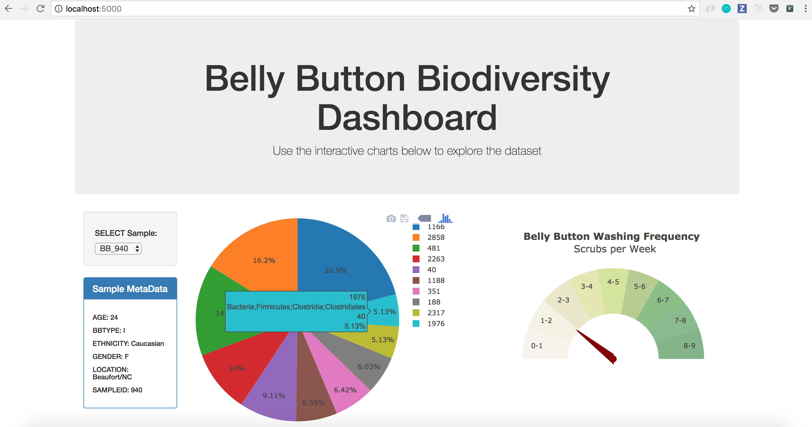

# Belly Button Biodiversity

In this assignment, an interactive dashboard was built to explore the [Belly Button Biodiversity DataSet](http://robdunnlab.com/projects/belly-button-biodiversity/).

## Step 1 - Plotly.js

Plotly.js was Used to build interactive charts for your dashboard:

   - A PIE chart that uses data from samples route (`/samples/<sample>`) to display the top 10 samples.

   - sample_values` was considered as the values for the PIE chart

   - `otu_ids` was used as the labels for the pie chart

   - `otu_labels` was employed as the hovertext for the chart

  

* A Bubble Chart that uses data from the samples route (`/samples/<sample>`) was created to display each sample:
  Using 
   - `otu_ids` for the x values

   - `sample_values` for the y values

   - `sample_values` for the marker size

   - `otu_ids` for the marker colors

   - `otu_labels` for the text values

  

* sample metadata  was desplayed from the route `/metadata/<sample>`

   - Displaying each key/value pair from the metadata JSON object on the page

* The dashboard is built in such a where that all the plots will update each time new sample is selected.

* The layout for the dashboard page dashboard page look something as following.
 

The following task is completely optional and is very advanced.

* A Gauge Chart was adapted from <https://plot.ly/javascript/gauge-charts/> to plot the Weekly Washing Frequency obtained from the route `/wfreq/<sample>`

* The guage is designed to Update the chart whenever a new sample is selected as see here

## Step 2 - Heroku

Our Flask app is Deploy  to Heroku using (http://robdunnlab.com/projects/belly-button-biodiversity/) sqlite file for the database

### Copyright

Data Boot Camp © 2019. All Rights Reserved.
